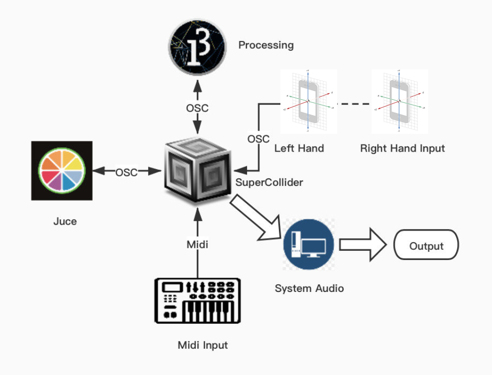
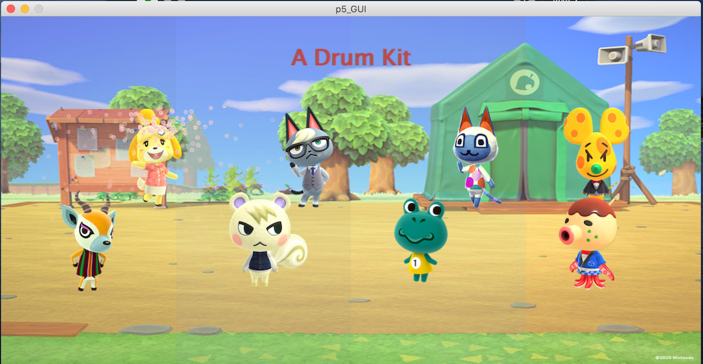

# DrumKit-Supercollider

## Links:
1. Project Link: https://github.com/Lorenzoncina/DrumKit-Supercollider.git.
2. docs/report.pdf
3. slides

## Description:
Create a set of drum sounds (min 3) and an interface to control them.
For the synthesis part (e.g., subtractive synthesis), use SuperCollider. Feel free to check
the examples on https://sccode.org and other resources online. You can implement even
non-traditional drum sounds if you want (e.g., not just percussive ones).
As far as the interaction part is concerned (e.g., synthesis parameters setting, play the drum,
etc.), you can exploit either MIDI or OSC communication protocols. For example, you can
use touchOSC app (https://hexler.net/products/touchosc). Alternatively, you can combine
Processing, JUCE to turn other devices (e.g., Arduino, Kinect, etc.) into input peripherals.
Be creative, feel free to combine different components for visualization, user interaction and
control.

## System Design
The DrumKit application design was based on classic analog drum machines, like the Roland TR-808, but the controllers are split up on several different platforms through which it's possible to interact with the sounds. The goal was to allow the user to play the DrumKit using any of these different platforms.

## Output:
- A brief presentation and demonstration of your work (max 5 minutes) that will be
given to the class.
- A more detailed report in which you illustrate your system and its implementation
(max 5 pages).
- A link to a repository containing the code (e.g. on GitHub) with minimal comments.

