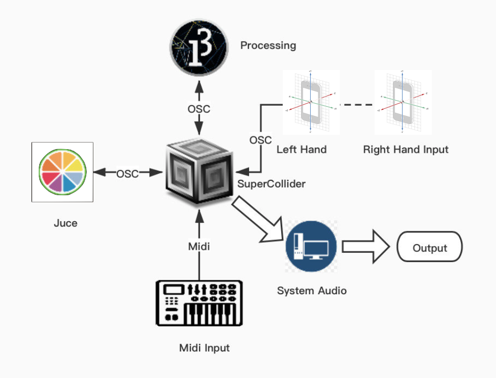
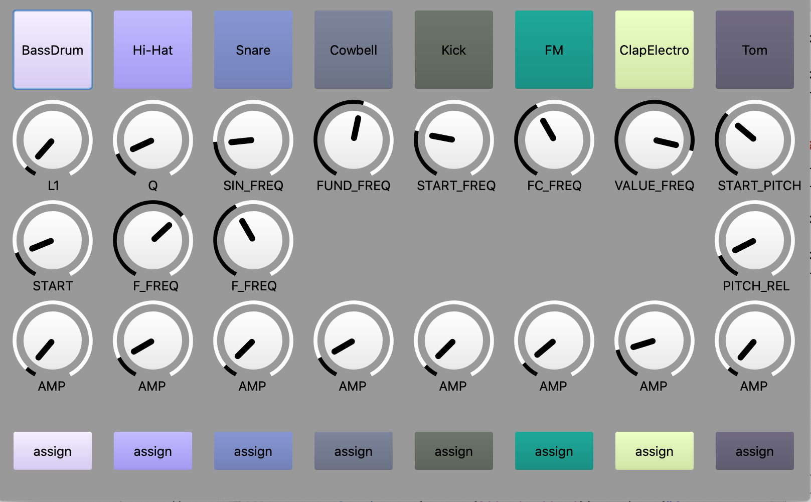

# DrumKit-Supercollider

## Links:
1. Project Link: https://github.com/Lorenzoncina/DrumKit-Supercollider.git.
2. docs/report.pdf
3. slides

## System Design
The DrumKit application design was based on classic analog drum machines, like the Roland TR-808, but the controllers are split up on several different platforms through which it's possible to interact with the sounds. The goal was to allow the user to play the DrumKit using any of these different platforms.

#### WATCH OUT! 
If you are not able to play the sounds as soon as you run the code for the first time, you need to touch all the knobs relative to that sound to properly hear it.

## Demo
A demo video is available on [YouTube](https://youtu.be/CN5pVXBAqJA).

